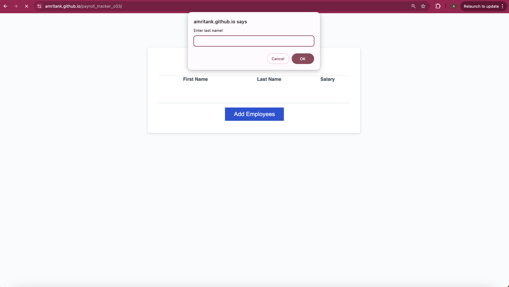
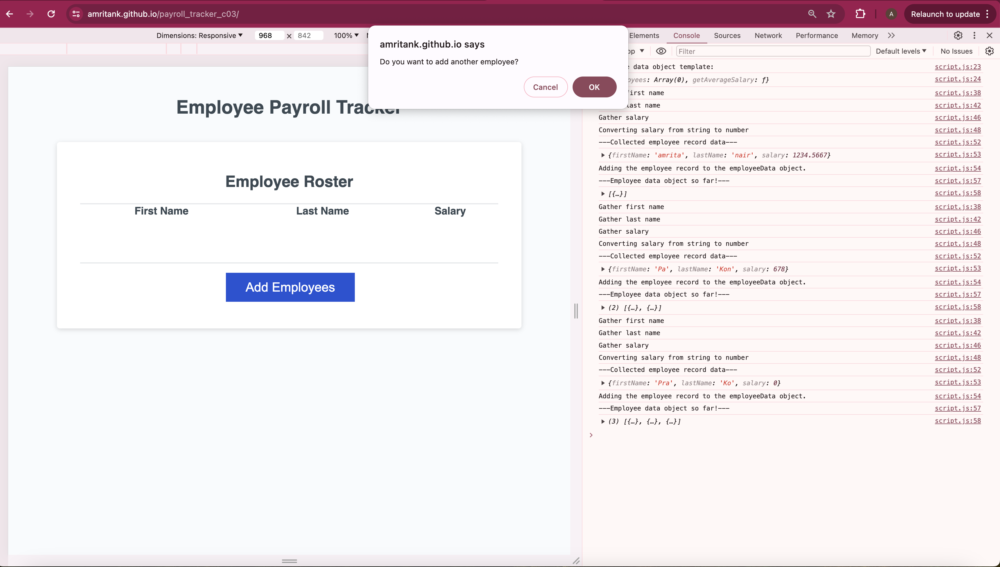
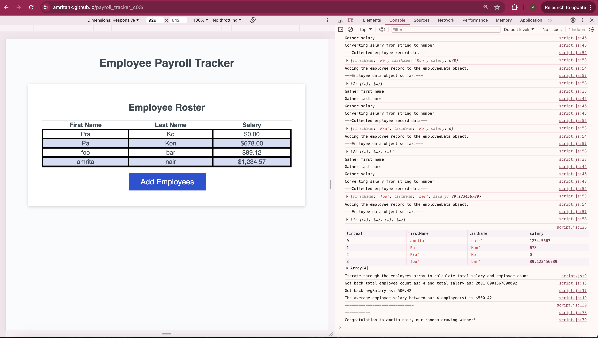

# Payroll Tracker
The Payroll Tracker webapp provides users with the ability to:
- record employee data which includes: frist and last name and salary.
- calculate the average salary across the employees stored. 
- picks a random employee as the winner of the week.

Upon visiting the webapp, the user will be with a HTML page, with an empty table and an 'Add Employee' button. Upon clicking the button, they are presented with three prompts one after the other to enter the first name, last name and salary respectively. Once done, the user can continue to add new employees by confirming when prompted: "Do you want to add another employee?". If they choose to discotinue, they will see the following behavior:
- all the employees added will be listed on the table in the page.
- on inspecting the console, the user can see the average salary across employees and the random winner of the week. 

They can repeat this workflow by click on the 'Add Employee' button again.

## Description

Installation
N/A

Usage
In order to use the webapp visit: https://amritank.github.io/payroll_tracker_c03/.

License
Please refer to the LICENSE in the repo.